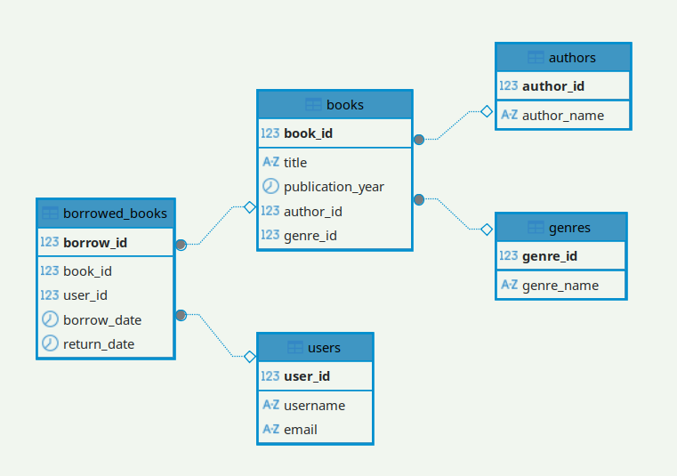

# goit-rdb-hw-04

## 1. Створіть базу даних для керування бібліотекою книг

```mysql
-- create database
CREATE DATABASE LibraryManagement;
USE LibraryManagement;

-- authors
CREATE TABLE authors (
    author_id INT AUTO_INCREMENT PRIMARY KEY,
    author_name VARCHAR(255) NOT NULL
);

-- genres
CREATE TABLE genres (
    genre_id INT AUTO_INCREMENT PRIMARY KEY,
    genre_name VARCHAR(255) NOT NULL
);

-- books
CREATE TABLE books (
    book_id INT AUTO_INCREMENT PRIMARY KEY,
    title VARCHAR(255) NOT NULL,
    publication_year YEAR NOT NULL,
    author_id INT,
    genre_id INT,
    FOREIGN KEY (author_id) REFERENCES authors(author_id),
    FOREIGN KEY (genre_id) REFERENCES genres(genre_id)
);

-- users
CREATE TABLE users (
    user_id INT AUTO_INCREMENT PRIMARY KEY,
    username VARCHAR(255) NOT NULL,
    email VARCHAR(255) NOT NULL
);

-- borrowed_books
CREATE TABLE borrowed_books (
    borrow_id INT AUTO_INCREMENT PRIMARY KEY,
    book_id INT,
    user_id INT,
    borrow_date DATE NOT NULL,
    return_date DATE,
    FOREIGN KEY (book_id) REFERENCES books(book_id),
    FOREIGN KEY (user_id) REFERENCES users(user_id)
);
```

### ER діаграма



## 2. Заповнення таблиць

```mysql
INSERT INTO authors (author_name) VALUES
('Author 1'),
('Author 2'),
('Author 3');

INSERT INTO genres (genre_name) VALUES
('Genre 1'),
('Genre 2'),
('Genre 3');

INSERT INTO books (title, publication_year, author_id, genre_id) VALUES
('Book 1', 2021, 1, 1),
('Book 2', 2020, 1, 2),
('Book 3', 2019, 2, 1),
('Book 4', 2022, 3, 3),
('Book 5', 2018, 3, 2);

INSERT INTO users (username, email) VALUES
('user1', 'user1@example.com'),
('user2', 'user2@example.com'),
('user3', 'user3@example.com');

INSERT INTO borrowed_books (book_id, user_id, borrow_date, return_date) VALUES
(1, 1, '2025-01-15', '2025-02-15'),
(2, 1, '2025-03-10', NULL),
(3, 2, '2025-01-20', '2025-02-20'),
(4, 3, '2025-01-25', NULL),
(5, 2, '2025-02-01', '2025-02-10');
```

### запити до БД

#### запит який виведе ім'я користувача, назву книги, автора та жанр

```mysql
SELECT
    u.username,
    b.title AS book_title,
    a.author_name,
    g.genre_name,
    bb.borrow_date,
    bb.return_date
FROM
    borrowed_books bb
JOIN
    books b ON bb.book_id = b.book_id
JOIN
    users u ON bb.user_id = u.user_id
JOIN
    authors a ON b.author_id = a.author_id
JOIN
    genres g ON b.genre_id = g.genre_id;
```

```
+----------+------------+-------------+------------+-------------+-------------+
| username | book_title | author_name | genre_name | borrow_date | return_date |
+----------+------------+-------------+------------+-------------+-------------+
| user1    | Book 1     | Author 1    | Genre 1    | 2025-01-15  | 2025-02-15  |
| user1    | Book 2     | Author 1    | Genre 2    | 2025-03-10  | NULL        |
| user2    | Book 3     | Author 2    | Genre 1    | 2025-01-20  | 2025-02-20  |
| user2    | Book 5     | Author 3    | Genre 2    | 2025-02-01  | 2025-02-10  |
| user3    | Book 4     | Author 3    | Genre 3    | 2025-01-25  | NULL        |
+----------+------------+-------------+------------+-------------+-------------+

```

#### запит який поверне користувачів, які не повернули книги

```mysql
SELECT u.user_id, u.username, u.email, b.title
FROM users AS u
JOIN borrowed_books AS bb ON u.user_id = bb.user_id
JOIN books AS b ON bb.book_id = b.book_id
WHERE bb.return_date IS NULL;
```

```
+---------+----------+-------------------+--------+
| user_id | username | email             | title  |
+---------+----------+-------------------+--------+
|       1 | user1    | user1@example.com | Book 2 |
|       3 | user3    | user3@example.com | Book 4 |
+---------+----------+-------------------+--------+
```

#### список користувачів з назвами книг і кількістю днів, протягом яких книга була у них

```mysql
SELECT u.user_id, u.username, b.title,
       DATEDIFF(bb.return_date, bb.borrow_date) AS days_borrowed
FROM users AS u
JOIN borrowed_books AS bb ON u.user_id = bb.user_id
JOIN books AS b ON bb.book_id = b.book_id
WHERE bb.return_date IS NOT NULL;
```

```
+---------+----------+--------+---------------+
| user_id | username | title  | days_borrowed |
+---------+----------+--------+---------------+
|       1 | user1    | Book 1 |            31 |
|       2 | user2    | Book 3 |            31 |
|       2 | user2    | Book 5 |             9 |
+---------+----------+--------+---------------+
```
